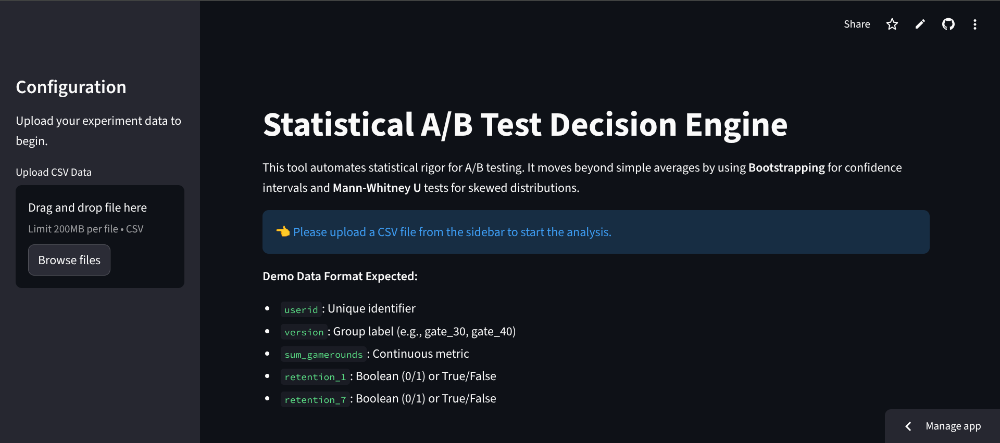
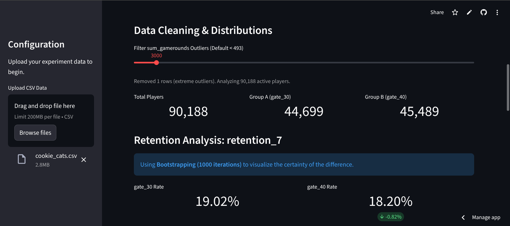
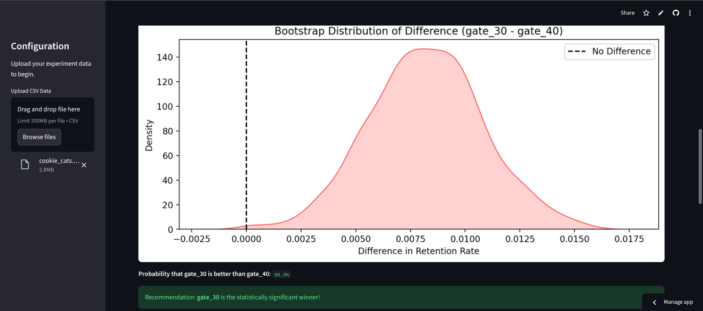
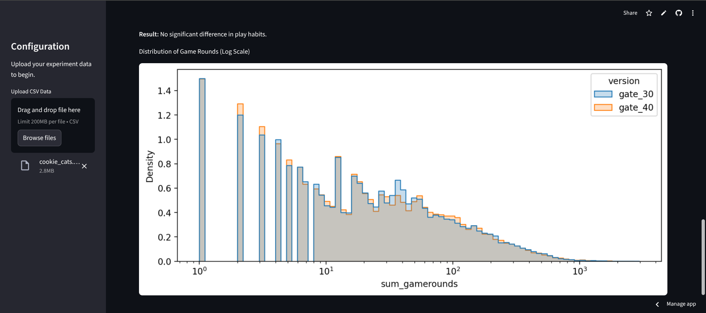

# Statistical A/B Test Decision Engine


## 📌 Project Overview
This tool automates the statistical analysis of mobile game A/B tests. It processes raw user logs to determine if product changes (e.g., moving a level gate) have a statistically significant impact on user retention.

I built this to replace manual Excel calculations with a rigorous **Bootstrapping** and **Mann-Whitney U** statistical pipeline wrapped in an interactive dashboard.

## 📂 Data Source
The dataset used for this analysis is the famous **Cookie Cats** A/B testing dataset.
- **Source:** [Kaggle - Mobile Games A/B Testing](https://www.kaggle.com/datasets/yufengsui/mobile-games-ab-testing)
- **File:** `cookie_cats.csv`

## The Case Study: Cookie Cats
**Scenario:** Should the "gate" (forced wait time) be moved from Level 30 to Level 40?
* **Control Group:** Gate at Level 30.
* **Test Group:** Gate at Level 40.
* **Metric:** 1-Day and 7-Day Retention.

## Features
* **Automated Data Cleaning:** Handles outlier detection (e.g., removing bots with impossible gameplay hours).
* **Statistical Rigor:** Implements **Bootstrapping (1000 iterations)** to visualize probability density distributions.
* **Interactive Dashboard:** Built with **Streamlit** to allow non-technical stakeholders to upload data and view results instantly.

## 📸 Dashboard Preview






## 🖥️ How to Run Locally
1. Clone the repo:
   ```bash
   git clone [https://github.com/aditya-rudre/AB-Testing-Engine.git](https://github.com/aditya-rudre/AB-Testing-Engine.git

Author: Aditya Rudre
